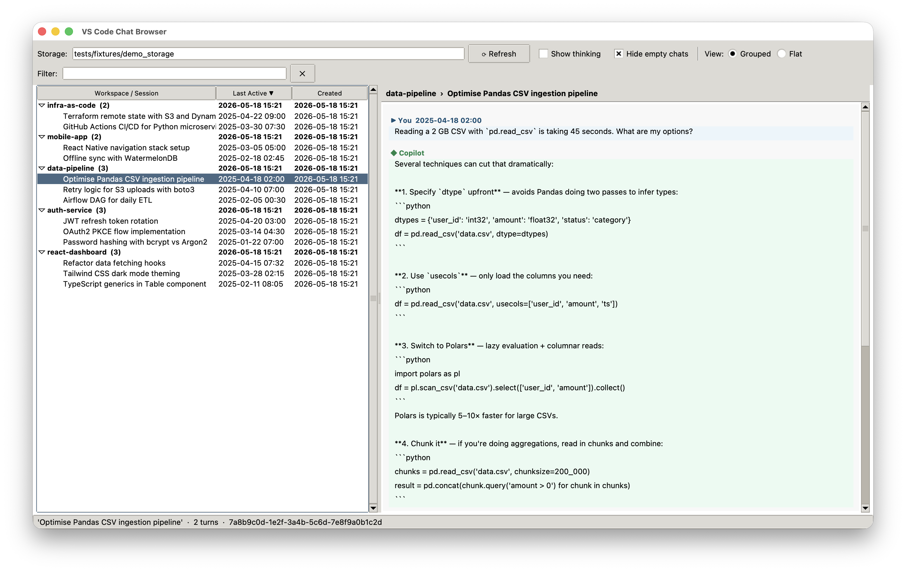

# VSCode Chat Browser — Documentation




## Overview

VSCode Chat Browser is a portable, cross-platform Python tool for browsing, backing up, copying, repairing, and deleting VS Code Copilot chat history stored in `workspaceStorage`.

It ships as both a Tkinter GUI application and a command-line interface (CLI) with no external dependencies beyond Python 3.10+.

---

## Why this exists

VS Code stores each workspace's chat history in a hash-named folder inside `workspaceStorage`. When you:

- rename a workspace folder
- move a project to a different path
- merge several single-folder workspaces into a multi-root workspace
- lose chat sessions after an update

…you may find sessions that are orphaned, invisible in the UI, or have a stale DB index. This tool gives you visibility and control over all of that.

---

## Default storage locations

| Platform | Default path |
|---|---|
| Windows | `%APPDATA%\Code\User\workspaceStorage` |
| macOS | `~/Library/Application Support/Code/User/workspaceStorage` |
| Linux | `~/.config/Code/User/workspaceStorage` |

Each workspace maps to a hash-named subdirectory (e.g. `43d22b07bf23d2dd/`). Inside that directory you will find:

| Path | Description |
|---|---|
| `workspace.json` | Human-readable workspace path / folder name |
| `state.vscdb` | SQLite database with the chat session index |
| `chatSessions/<uuid>.jsonl` | Individual chat session files (append log format) |
| `chatSessions/<uuid>.json` | Older snapshot-format session files |

---

## Quick start

### Prerequisites

- Python 3.10 or later
- No other runtime dependencies

### Installation

**From PyPI (recommended):**

```bash
pip install vscode-chat-browser
```

**From source:**

```bash
git clone https://github.com/yourname/VSCode-Chat-Browser
cd VSCode-Chat-Browser
pip install -e .
```

### Running the graphical UI

Always close VS Code before making changes to session data.

**Using the bundled launcher scripts:**

| Platform | Launcher |
|---|---|
| Windows | `workspace_chat_browser_Win.bat` |
| macOS | `workspace_chat_browser_macOS.terminal` |
| Linux / any terminal | `python3 src/vscode_chat_browser/workspace_chat_browser.py` |

**Using the CLI entry point (pip install):**

```bash
vscode-chat-browser ui
```

**Pointing to a custom storage directory:**

```bash
vscode-chat-browser ui --storage-root /path/to/workspaceStorage
```

---

## Graphical UI tour

The UI is divided into three panels:

```
┌─────────────────────────────────────────────────────────┐
│  Storage path bar   [ ⟳ Refresh ]  [ View: Grouped/Flat ]│
│  Filter / search bar                                     │
├────────────────────┬────────────────────────────────────┤
│  Workspace / session│  Conversation viewer              │
│  tree              │                                     │
│                    │  [You]  message text                │
│  > MyProject       │  [Copilot]  response text           │
│    Session title   │  …                                  │
│    …               │                                     │
└────────────────────┴────────────────────────────────────┘
```

### Top bar controls

| Control | Action |
|---|---|
| Storage path + ⟳ Refresh | Set the workspaceStorage root and reload |
| Show thinking | Toggle display of Copilot reasoning blocks |
| Hide empty chats | Filter out sessions with no messages |
| Grouped / Flat | Switch between workspace-grouped and flat session list |

### Filter bar

Type any text to filter sessions by title or workspace name. The tree updates live.

### Tree columns

| Column | Description |
|---|---|
| Name | Session title or workspace folder name |
| Last message | Timestamp of the most recent message |
| Created | File creation time |
| Source | `db` (index only), `disk` (file only), `both` (healthy) |
| ⚠ | Present when a mismatch is detected between the DB index and files on disk |

### Right-click context menu

Right-clicking a workspace or session node opens a context menu with all available actions:

**On a session:**
- Show conversation
- Copy session to another workspace
- Archive session (zip)
- Repair index entry
- Delete session

**On a workspace:**
- Copy all sessions to another workspace
- Archive workspace (zip)
- Repair all index mismatches
- Restore from archive
- Delete all chat sessions
- Create snapshot backup

---

## Mismatch detection and repair

The tool compares the `state.vscdb` DB index against the actual `.jsonl` / `.json` files on disk and flags three types of mismatch:

| Mismatch | Meaning |
|---|---|
| `In DB index but no session file found on disk` | DB references a session whose file was deleted or lost |
| `File exists on disk but not in DB index` | A session file was copied in manually or the index was corrupted |
| `DB marks session as empty but file exists on disk` | VS Code flagged the session as empty, but data is present |

Use **Repair** (single session or all) to re-synchronise the index. A timestamped `state.vscdb.repair-backup-<stamp>` is created automatically unless `--no-backup` is passed.

---

## Session file format

Session files use an append-log format. Each line is a JSON object:

| `kind` | Meaning |
|---|---|
| `0` | Full initial state snapshot (value in `v`) |
| `1` | Property update: key path in `k`, new value in `v` |
| `2` | Array append: key path in `k`, item(s) to append in `v` |

After replaying all lines, the resulting `state.requests[]` array holds each conversation turn:

| Field | Content |
|---|---|
| `request.message.text` | User prompt text |
| `request.response[]` | List of content parts |
| response item (no `kind`) | Main markdown text in `value` |
| response item `kind="thinking"` | Copilot reasoning block in `value` |
| response item `kind="toolInvocationSerialized"` | Tool call summary |

---

## See also

- [CLI Reference](cli-reference.md) — all commands with arguments and examples
- [Architecture & Contributing](architecture.md) — code layout, test structure, and how to contribute
